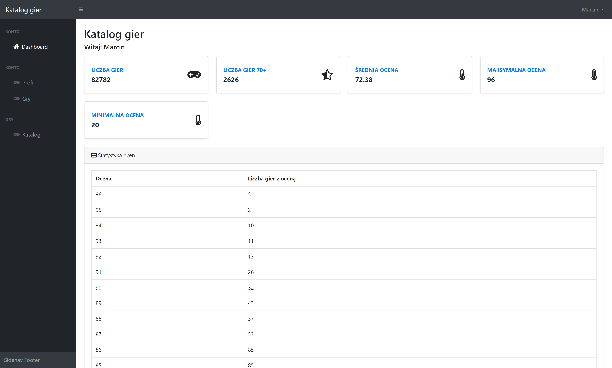
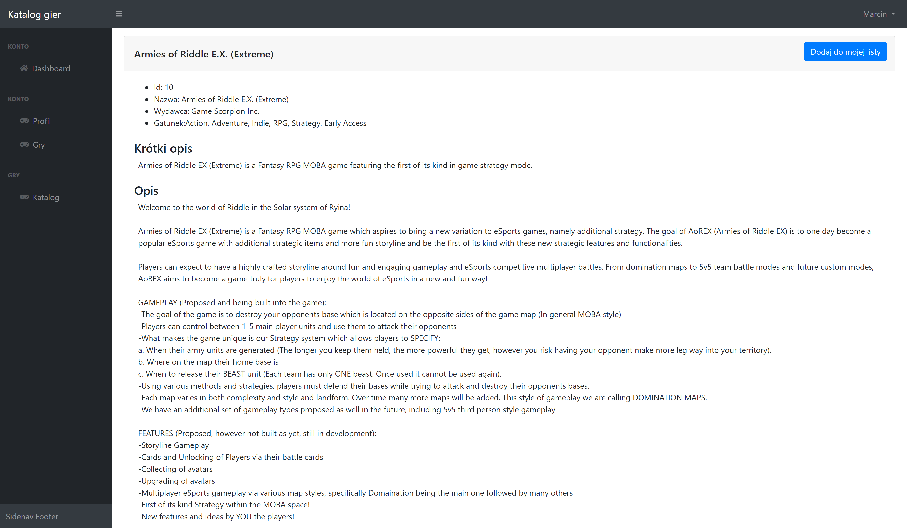
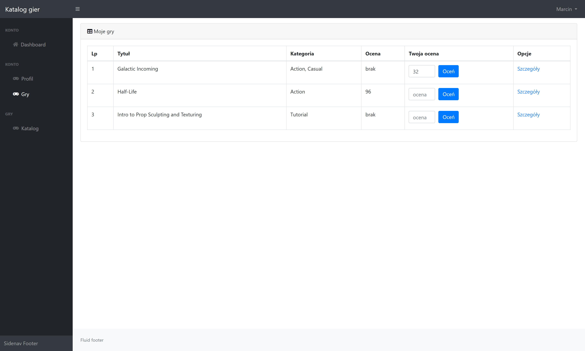
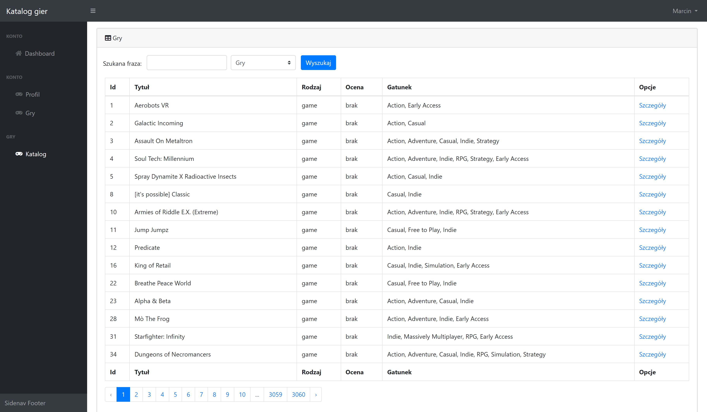
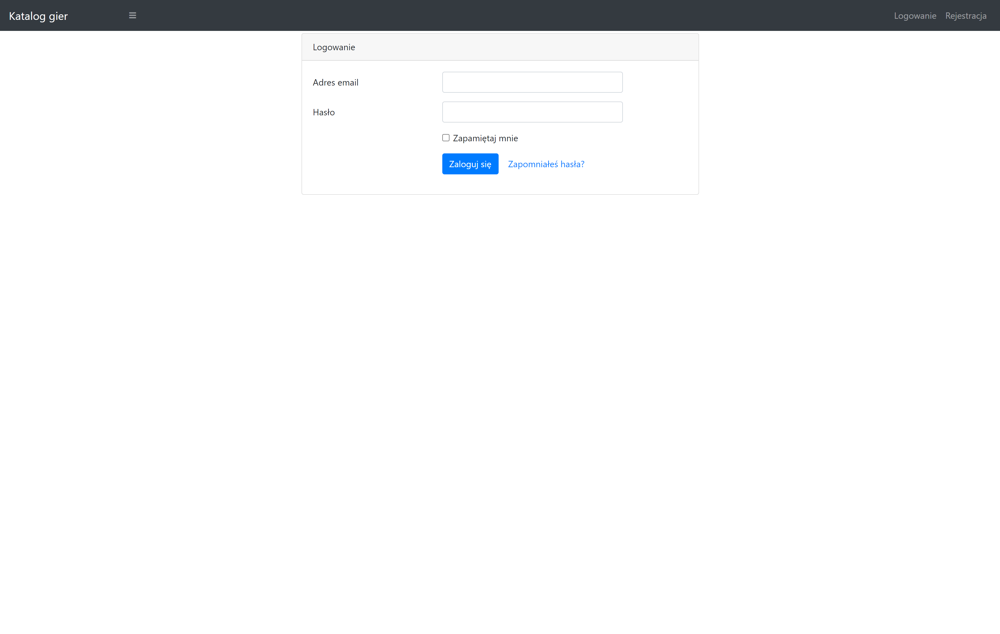

# Game Rater

This web application is designed to provide users with a comprehensive way to explore and review games. It offers a wide range of features including user account management, game catalog exploration, personalized game lists, and detailed game statistics. The platform is built on the Laravel framework, adhering to the MVC architecture and the Repository design pattern.

## Table of Contents
- [Features](#features)
- [Technologies](#technologies)
- [Database design and structure](#database-design-and-structure)
- [Design patterns](#design-patterns)
- [Images](#images)
- [Installation](#installation)

## Features

### User authentication and profile management
- **Account creation**: Users can create an account to access the platform.
- **Password recovery**: In case of forgotten passwords, users can reset their passwords via email.
- **Dashboard**: Once logged in, users are greeted with a personalized dashboard that displays:
    - Total number of games in the catalog.
    - Number of games with a rating of 70+ (data fetched from MetaCritic).
    - Average game rating, highest rating, and lowest rating.
    - Detailed statistics on the distribution of game ratings.
- **Profile editing**: Users can update their profile information including phone number, address, name, and avatar.

### Game catalog and reviews
- **Game catalog**: A comprehensive catalog of games sourced from the Steam database, available only to logged-in users.
    - **Filtering**: Users can filter games by name or category.
    - **Game details**: Each game has a dedicated detail page with an in-depth description.
    - **Add to my list**: Users can add games to their personal list from the game detail page.
- **Personal game list**:
    - Users can maintain a list of games they have added to their personal collection.
    - Each game in this list can be rated from 0 to 100, allowing users to maintain their own ratings.

### Statistics and top games
- **Rating statistics**: Dashboard shows a detailed breakdown of how many games have specific ratings (e.g., how many games have a rating of 96, 95, etc.).
- **Top games list**: The best games, according to the ratings, are displayed prominently for easy access.

## Technologies
- **Laravel**: PHP framework used for the backend, adhering to the MVC architecture.
- **Laravel UI**: The application uses Laravel UI for user authentication scaffolding, including login, registration, and password reset functionality.
- **CSS**: For styling the application.
- **JavaScript**: Provides interactivity within the application.
- **Bootstrap**: A front-end framework for responsive design.
- **SQLite**: The database used to store user data, game data, and reviews.

## Database design and structure

The application uses SQLite for database management. Below is a brief overview of the main tables:

- **Users**: Stores user information such as name, email, password, phone number, address, and avatar.
- **Games**: Contains the full catalog of games sourced from Steam, including game details and MetaCritic ratings.
- **Reviews**: Stores user-specific ratings for games added to their personal list.
- **Categories**: Used for categorizing games within the catalog.
- **UserGames**: A pivot table that links users with their selected games.

## Design patterns

The application follows the **Model-View-Controller (MVC)** pattern for structuring the codebase. Additionally, it uses the **Repository** design pattern to abstract the data layer, making it easier to manage database queries and business logic separately.

## Images

- 
- 
- 
- 
- 

## Installation

To set up the Game Review Platform locally, follow these steps:

1. Clone the repository:
   ```bash
   git clone https://github.com/yourusername/gamereviewplatform.git

2. Install dependencies via Composer:
   ```bash
   composer install

3. Set up the environment file:
   ```bash
   cp .env.example .env

4. Update the database configuration to use SQLite:
   ```bash
   DB_CONNECTION=sqlite
   DB_DATABASE=/path_to_your_database/database.sqlite

5. Run migrations to set up the database:
   ```bash
   php artisan migrate

6. Install Laravel UI for authentication scaffolding:
   ```bash
   composer require laravel/ui
   php artisan ui bootstrap --auth
   npm install
   npm run dev

7. Start the development server:
   ```bash
   php artisan serve
